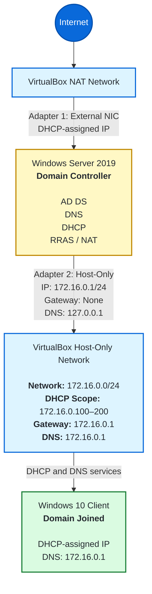

# Active Directory Lab Architecture

## Network Diagram

## Network Design

The domain controller uses two virtual network adapters:

- **Adapter 1 — NAT:** Provides external network connectivity.
- **Adapter 2 — Host-Only:** Connects the domain controller, Windows 10 client, and host computer through an isolated lab network.

The domain controller provides Active Directory authentication, DNS, DHCP, and routing services to the Windows 10 client.

## IP Addressing

| Component | Address or Range | Purpose |
|---|---|---|
| Host-Only network | `172.16.0.0/24` | Lab subnet |
| Domain controller | `172.16.0.1/24` | Static server address |
| DHCP scope | `172.16.0.100–200` | Client addresses |
| Default gateway | `172.16.0.1` | RRAS routing |
| DNS server | `172.16.0.1` | Domain name resolution |
