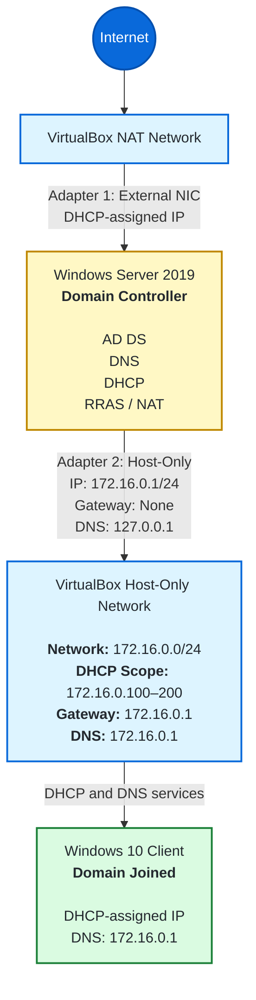

# Active-Directory-Security-Home-Lab 
A virtualized Windows Server 2019 Active Directory environment built to simulate core enterprise identity, networking, and security-monitoring operations.

The lab includes Active Directory Domain Services, DNS, DHCP, RRAS/NAT, a domain-joined Windows 10 client, PowerShell-based bulk user provisioning, and Windows Security Event Log analysis.

## Lab Architecture


The Windows Server 2019 domain controller uses two virtual network adapters:

- A NAT adapter for external connectivity
- A Host-Only adapter for communication between the domain controller, Windows 10 client, and host computer

The domain controller provides DHCP, DNS, authentication, and routing services to the domain-joined client.

## What I Implemented

### Active Directory Domain Services

- Installed and configured Active Directory Domain Services.
- Promoted Windows Server 2019 to a domain controller.
- Created an Active Directory forest and domain.
- Joined a Windows 10 client to the domain.

### DNS and DHCP

- Configured DNS to support Active Directory name resolution.
- Created a DHCP scope for automatic client addressing.
- Configured the domain controller as the client’s DNS server.
- Verified network connectivity and domain name resolution.

### Organizational Units and Users

- Created Organizational Units to represent simulated departments.
- Assigned users to appropriate Organizational Units and groups.

### PowerShell Automation

- Developed a PowerShell script to provision more than 200 simulated users.
- Automated repetitive account-creation tasks.
- Used generated user data to simulate an enterprise Active Directory environment.

### Security Monitoring

- Configured and reviewed Windows Security Event Logs.
- Investigated successful and failed authentication activity.
- Used Event Viewer and PowerShell to locate security-relevant events.

## Security Events Examined

| Event ID | Description | Security Use |
|---|---|---|
| 4624 | Successful logon | Identify successful authentication activity |
| 4625 | Failed logon | Detect failed authentication attempts |
| 4720 | User account created | Monitor new account creation |
| 4722 | User account enabled | Detect account enablement |
| 4726 | User account deleted | Monitor account deletion |
| 4740 | User account locked out | Investigate repeated authentication failures |

## Technologies Used

- Windows Server 2019
- Windows 10
- Active Directory Domain Services
- PowerShell
- DNS and DHCP
- RRAS/NAT
- Windows Event Viewer
- VirtualBox

## Repository Structure

```text
Active-Directory-Project/
├── README.md
├── images/
│   └── active-directory-architecture.png
├── scripts/
│   └── create-users.ps1
└── sample-data/
    └── sample-users.csv
